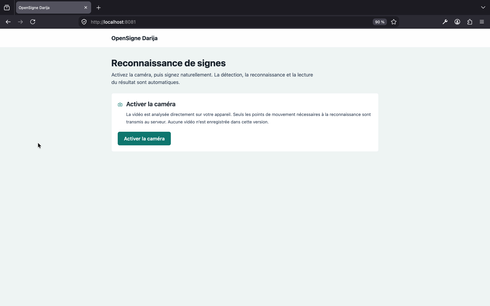
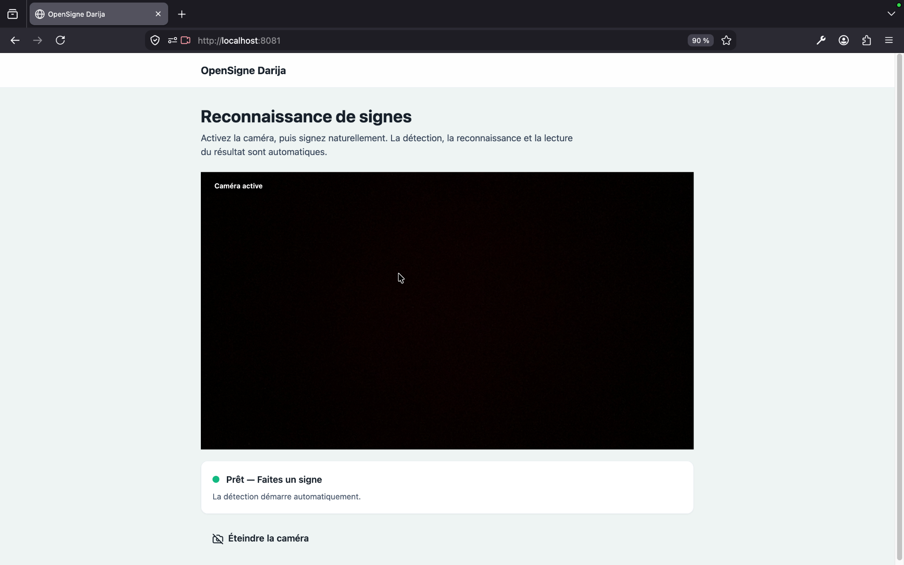

# OpenSigne Darija

**OpenSigne Darija** is an open-source, privacy-preserving research prototype for isolated Moroccan Sign Language recognition.

Its current user flow is intentionally focused on one task:

```text
Activate the camera → perform one Moroccan sign → display its meaning → hear it aloud
```

The application recognizes **one sign at a time**. It is not a continuous sign-language interpreter and does not translate complete sentences.

> **Research status:** OpenSigne Darija is an experimental small-dataset prototype. It is not production-ready and must not be presented as a replacement for a professional interpreter.

---

## Core Experience

The public recognition interface is available at:

```text
http://localhost:8081/app/recognition
```

The application is anonymous and requires no account.

### Application Preview

#### Camera activation



*The recognition page before camera activation.*

#### Live recognition



*The camera is active and the application is ready to detect a sign automatically.*

The public interface contains only:

* the OpenSigne Darija application name;
* a camera activation control;
* the live camera preview;
* the current recognition status;
* the recognized Arabic result;
* an optional audio replay control;
* a camera deactivation control.

There is no login, model selector, recognition-mode selector, dataset management interface, or manual start, finish, or submit action.

After the visitor activates the camera, the complete recognition cycle runs automatically:

```text
Camera activation
→ sign-boundary detection
→ landmark collection
→ sequence-quality validation
→ recognition
→ Arabic result display
→ speech synthesis
→ cooldown
→ preparation for the next sign
```

---

## Privacy-Preserving Recognition

Camera frames never leave the browser.

MediaPipe processes the live video locally and produces a normalized landmark tensor with the exact shape:

```text
60 × 75 × 3
```

Each frame contains landmarks for:

```text
33 pose landmarks
21 left-hand landmarks
21 right-hand landmarks
```

Only finite normalized landmark coordinates and approved segmentation metadata are transmitted to the public API.

The API schema explicitly rejects:

* raw video;
* image files;
* canvas data;
* microphone audio;
* base64-encoded camera content;
* unsupported or malformed request fields.

The browser never communicates directly with the inference or speech services.

```text
React camera
→ browser-based MediaPipe processing
→ automatic sign segmentation
→ POST /api/v1/recognitions/word
→ internal ONNX Runtime inference
→ Arabic label or UNKNOWN
→ POST /api/v1/speech/sign
→ automatic local audio playback
```

Sequences with insufficient landmark quality or low prediction confidence return:

```text
UNKNOWN
```

Unknown results are displayed but are not spoken aloud.

---

## Recognition Scope

OpenSigne Darija currently performs **isolated-sign recognition**.

The system expects the visitor to:

1. activate the camera;
2. position themselves correctly;
3. perform one supported sign;
4. wait for the result;
5. allow the automatic cooldown to complete;
6. perform the next sign.

The current implementation does not provide:

* continuous sentence recognition;
* grammatical sign-language translation;
* multi-sign sequence decoding;
* signer identification;
* facial-expression interpretation;
* professional interpretation services.

---

## Local Dataset Policy

Training and preprocessing use only the existing local dataset stored at:

```text
ml/data/external/mosl-video-dataset/
```

The native dataset manifest contains:

```text
2,216 videos
```

No runtime component, Makefile command, training module, or preprocessing module downloads or imports data from Kaggle, Mendeley, ScienceDirect, or any other external source.

Raw videos and processed landmark caches remain local and are excluded from Git.

External references are retained only for attribution, provenance, citation, licensing notes, and historical documentation.

---

## Active Model Package

The active model package is located at:

```text
artifacts/models/mosl-isolated-sign-v1/
```

The package includes:

* `model.onnx`;
* supported labels;
* Arabic label mappings;
* input and output schemas;
* confidence calibration data;
* evaluation metrics;
* checksums;
* dataset and split metadata;
* model-card documentation.

The model is trained only on classes with enough independent local examples.

Dataset splits are:

* deterministic;
* checksum-grouped;
* collision-safe;
* reproducible.

This prevents identical or duplicate-content samples from being distributed across training, validation, and test sets.

---

## Dataset Audit

At the minimum-five-sample eligibility threshold, the collision-safe audit identified:

```text
11 labels
59 eligible samples
```

The resulting split is:

```text
37 training samples
11 validation samples
11 test samples
```

The active runtime scope is deliberately narrower.

It contains only three lexical signs:

```text
اب
احب
سوق
```

The active three-class subset contains:

```text
15 total samples
9 training samples
3 validation samples
3 test samples
```

Ambiguous Arabic mappings are excluded instead of being silently merged.

Examples of excluded ambiguous mappings include:

```text
لون
نادي
```

The earlier two-class package:

```text
mosl-word-smoke-v1
```

is retained only as a technical smoke-test artifact. It is not part of the public recognition flow.

---

## Evaluation Results

The held-out closed-set test contains only three samples: one sample for each active class.

Measured closed-set performance:

| Metric            | Result |
| ----------------- | -----: |
| Top-1 accuracy    |  0.667 |
| Top-3 accuracy    |  1.000 |
| Macro F1 score    |  0.556 |
| Balanced accuracy |  0.667 |

The model was also evaluated against 68 held-out out-of-vocabulary samples.

Measured rejection performance:

| Metric                           | Result |
| -------------------------------- | -----: |
| Out-of-vocabulary rejection rate | 44.12% |
| False-acceptance rate            | 55.88% |

These results show that the current prototype can demonstrate the complete recognition pipeline, but its unknown-sign rejection remains insufficient for production use.

Because the evaluation set is extremely small, all accuracy measurements are highly uncertain and must be interpreted cautiously.

Unsupported signs are not claimed as recognized vocabulary.

---

## ONNX Model Information

The active ONNX model has the following properties:

```text
File size: 411,736 bytes
```

```text
SHA-256:
24678fc01c86bb64a47f832ae800bd475e788a91c5b103122115a37fcdd6ad54
```

Measured over 40 local CPU inference runs:

| Performance metric  |   Result |
| ------------------- | -------: |
| Mean inference time | 0.647 ms |
| P95 inference time  | 0.735 ms |

These measurements represent model inference only. They do not include camera capture, MediaPipe processing, network communication, segmentation, speech generation, or browser rendering.

---

## System Architecture

OpenSigne Darija uses a service-oriented local architecture.

### `apps/web`

Minimal React and Vite application responsible for:

* camera permission and lifecycle;
* browser-side MediaPipe processing;
* automatic sign-boundary detection;
* landmark sequence construction;
* recognition-state display;
* Arabic result rendering;
* automatic audio playback;
* cooldown management.

### `services/api`

The only public backend service.

Responsibilities include:

* strict request validation;
* payload-size enforcement;
* rate limiting;
* recognition orchestration;
* supported-label validation;
* Arabic label mapping;
* confidence and quality handling;
* speech-service proxying;
* rejection of prohibited media data.

### `services/inference`

Internal fail-closed ONNX Runtime service.

Responsibilities include:

* model-package validation;
* schema verification;
* checksum validation;
* calibrated ONNX inference;
* confidence-based rejection;
* controlled error handling.

This service is not directly exposed to the browser.

### `services/speech`

Internal offline Arabic speech adapter.

Language preference order:

```text
ar-MA
ar
```

The service uses locally available system text-to-speech capabilities and is not directly exposed to the browser.

### `ml`

Local machine-learning workspace for:

* dataset auditing;
* provenance validation;
* landmark preprocessing;
* deterministic dataset splitting;
* three-architecture benchmarking;
* model training;
* confidence calibration;
* ONNX export;
* package validation;
* performance evaluation.

### `infrastructure/nginx`

The only public gateway.

It routes approved application and API traffic while keeping inference and speech services internal.

---

## Repository Structure

```text
OpenSigne-Darija/
├── apps/
│   └── web/
│       └── React/Vite recognition interface
│
├── services/
│   ├── api/
│   │   └── Public FastAPI validation and orchestration service
│   ├── inference/
│   │   └── Internal ONNX Runtime inference service
│   └── speech/
│       └── Internal offline Arabic speech service
│
├── ml/
│   ├── assets/
│   ├── data/
│   ├── preprocessing/
│   ├── training/
│   ├── evaluation/
│   └── validation/
│
├── artifacts/
│   ├── models/
│   └── reports/
│
├── infrastructure/
│   └── nginx/
│
├── docs/
├── docker-compose.yml
├── Makefile
└── .env.example
```

---

## Running with Docker

### Prerequisites

Install Docker and Docker Compose.

The following local files must already exist:

```text
ml/assets/mediapipe/holistic_landmarker.task
```

```text
artifacts/models/mosl-isolated-sign-v1/model.onnx
```

The active model directory must also contain all required package metadata, mappings, schemas, checksums, and calibration files.

### Start the application

```bash
cp .env.example .env
docker compose config
docker compose build
docker compose up -d
docker compose ps
```

Open:

```text
http://localhost:8081/app/recognition
```

The runtime uses real inference by default.

If the model package is missing, corrupted, incompatible, or internally inconsistent, the system fails closed. It does not silently replace real predictions with mock results.

---

## Local Development

Install project dependencies:

```bash
make install
```

Run backend tests:

```bash
make test-backend
```

Run inference-service tests:

```bash
make test-inference
```

Run machine-learning tests:

```bash
make test-ml
```

Test local Arabic speech:

```bash
make speech-test
```

Run frontend tests and validation:

```bash
cd apps/web
npm test -- --run
npm run lint
npm run build
npm run test:e2e
```

The Makefile also provides focused commands for:

* local dataset auditing;
* landmark preprocessing;
* deterministic split generation;
* model training;
* model benchmarking;
* ONNX export;
* calibration;
* package validation;
* performance verification.

Training dependencies are installed in:

```text
ml/.venv
```

The inference service uses a separate, smaller environment to reduce runtime complexity and unnecessary dependencies.

---

## Configuration

Create the local configuration file:

```bash
cp .env.example .env
```

Important configuration groups include:

* local MediaPipe asset paths;
* strict V1 API schema settings;
* request-body size limits;
* landmark tensor requirements;
* real inference package paths;
* supported-sign mappings;
* Arabic label mappings;
* calibration files;
* quality and confidence thresholds;
* internal speech-service configuration;
* offline Arabic voice preferences;
* rate-limiting settings.

Secrets, local datasets, generated landmark caches, and private model-development files must remain outside Git.

The project does not require or accept external-dataset credentials.

---

## Security Model

OpenSigne Darija follows a privacy-first, fail-closed design.

Security controls include:

* explicit camera-permission requests;
* browser-side frame processing;
* no raw-camera upload;
* disabled microphone access at the public gateway;
* strict request schemas;
* finite-coordinate validation;
* exact tensor-shape validation;
* request-body size limits;
* rate limiting;
* internal-only inference and speech services;
* model-package checksum verification;
* calibrated unknown-sign rejection;
* no silent fallback to mock predictions.

The public API accepts only the minimum structured data required for recognition.

For additional details, see:

```text
SECURITY.md
docs/security.md
```

---

## Evidence and Technical Reports

### Recognition-process audit

```text
docs/audits/core-recognition-process-audit.md
```

### Pre-simplification test baseline

```text
docs/audits/pre-simplification-test-baseline.md
```

### Final implementation and validation report

```text
docs/reports/core-recognition-process-final-report.md
```

### Local dataset audit

```text
artifacts/reports/local-mosl-dataset-audit.json
```

### Supported vocabulary

```text
artifacts/reports/supported-sign-vocabulary-v1.json
```

### Dataset split report

```text
artifacts/reports/model-v1-split-report.json
```

### Dataset provenance and citation

```text
docs/attributions/mendeley-mosl-v1.md
```

---

## Current Limitations

The current prototype is constrained by the available source data.

Known limitations include:

* only three active lexical signs;
* very few independent examples per supported class;
* only three closed-set held-out test samples;
* unavailable signer-identity metadata;
* limited signer diversity;
* sensitivity to camera position;
* sensitivity to body and hand framing;
* sensitivity to lighting conditions;
* limited robustness to unseen signs;
* high out-of-vocabulary false acceptance;
* no continuous sentence recognition;
* no linguistic or grammatical translation layer.

The project should therefore be evaluated as a verified end-to-end research pipeline rather than as a complete sign-language interpretation product.

---

## Responsible Use

OpenSigne Darija does not replace a qualified professional interpreter.

It is not certified for:

* medical communication;
* emergency communication;
* legal interpretation;
* financial decisions;
* government or administrative procedures;
* safety-critical communication.

Recognition output may be incorrect, incomplete, or misleading. Users must independently verify important information.

---

## Open-Source Contribution

Project contribution and governance information is available in:

```text
CONTRIBUTING.md
SECURITY.md
LICENSE
docs/security.md
```

Contributions should preserve the project’s core principles:

1. camera frames remain in the browser;
2. only validated landmark data reaches the public API;
3. unsupported signs return `UNKNOWN`;
4. model scope and evaluation results remain transparent;
5. no remote dataset is silently introduced;
6. no mock inference is used as a hidden production fallback;
7. limitations are documented honestly.

---

## Project Summary

OpenSigne Darija currently demonstrates a complete local recognition pipeline:

```text
Camera
→ browser landmarks
→ automatic segmentation
→ strict API validation
→ ONNX inference
→ Arabic result
→ offline speech
```

The pipeline is functional, measurable, privacy-preserving, and reproducible within its documented three-sign scope.

Its next major challenge is not interface complexity. It is the creation of a larger, better-balanced, signer-diverse, clearly licensed Moroccan Sign Language dataset that can support reliable training, rejection of unsupported signs, and meaningful real-world evaluation.
