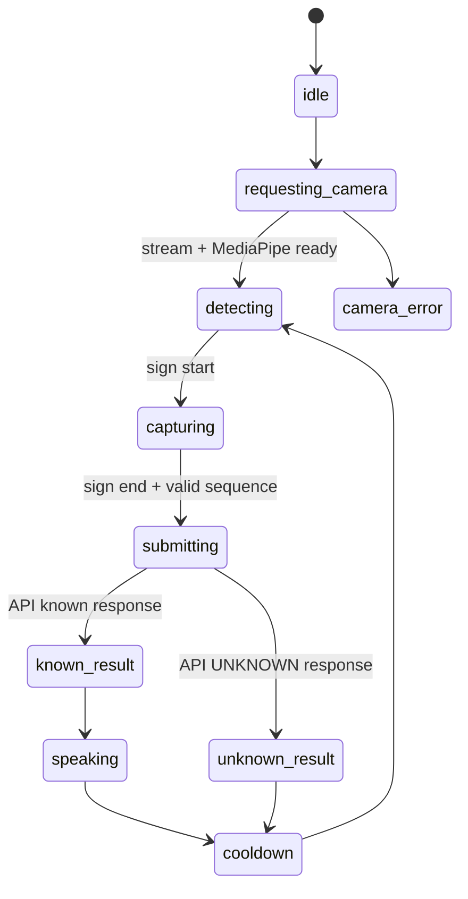

# Recognition State Machine

The browser owns recognition state because it owns camera permission, MediaPipe,
frame cadence, and duplicate suppression.

UNKNOWN is a terminal decision for that capture and must not trigger speech. A
held sign is suppressed through cooldown and reset rules so it is not recognized
repeatedly.
