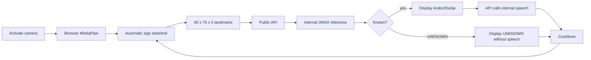

# Runtime Flow

The product contract is one automatic, anonymous isolated-sign loop:

Only normalized finite landmarks and approved segmentation metadata leave the
browser. The browser calls same-origin `/api` routes only. Nginx is the only public
gateway; API, inference, speech, and web containers stay internal behind it.
